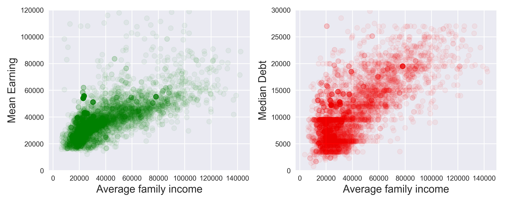

# Project: Earning and Debt of College Students in U.S.

Objective: 
Build a machine learning model to predict college students' earning and debt based on data on [College Scorecard](https://collegescorecard.ed.gov/data/).

!(figure1.jpg) 

 

Remarks:

