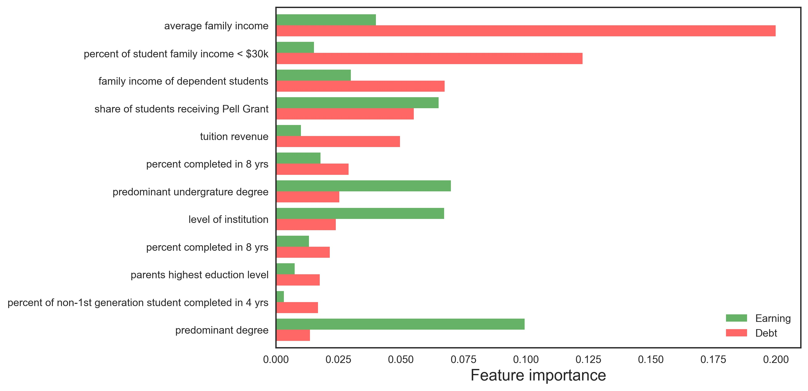

# Project: Earning and Debt of College Students in U.S.

**Objective**: 
Build a machine learning model to predict college students' earning and debt based on data from [College Scorecard](https://collegescorecard.ed.gov/data/).

 

**Figure 1:** Feature importance of a random forest model illustrating the key features determining college students' earning and debt.

 

**Figure 2:** Both the mean earning and median debt of college students show important dependences on the average family income.

